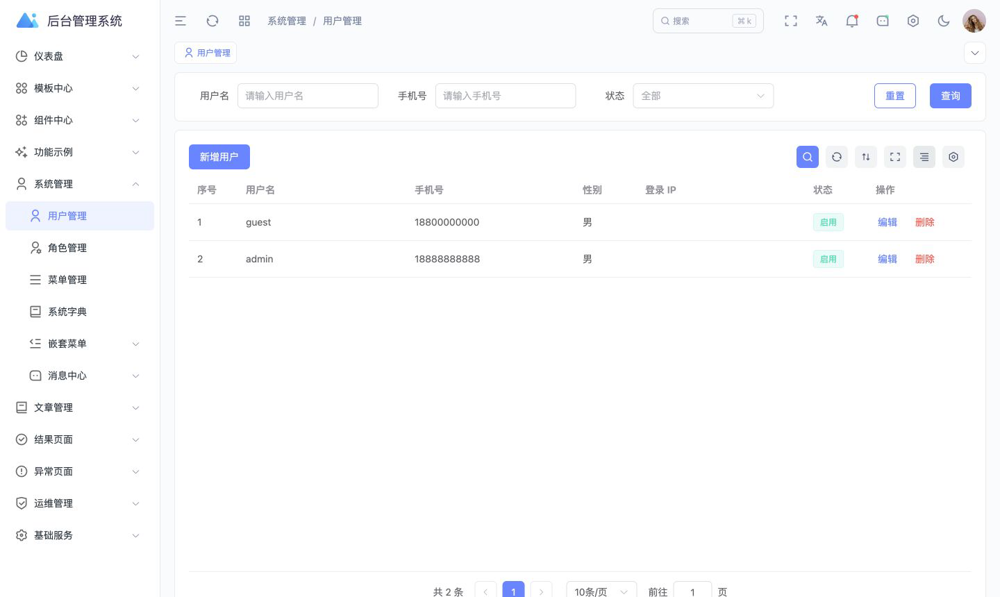
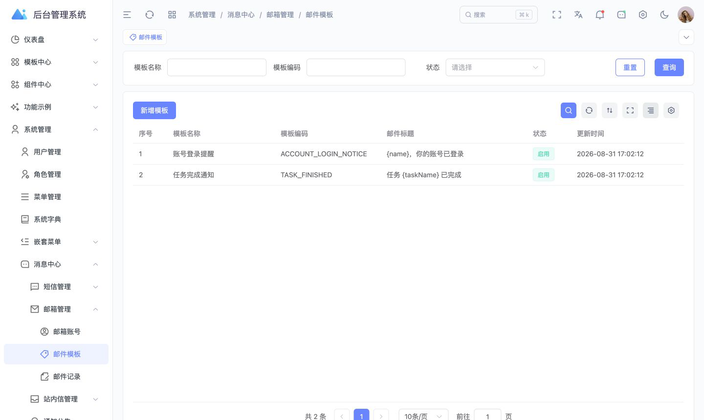
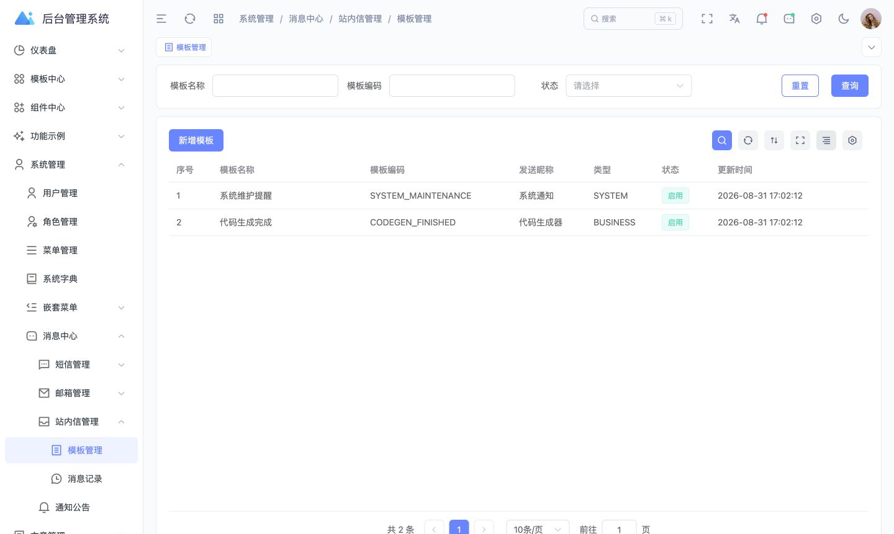
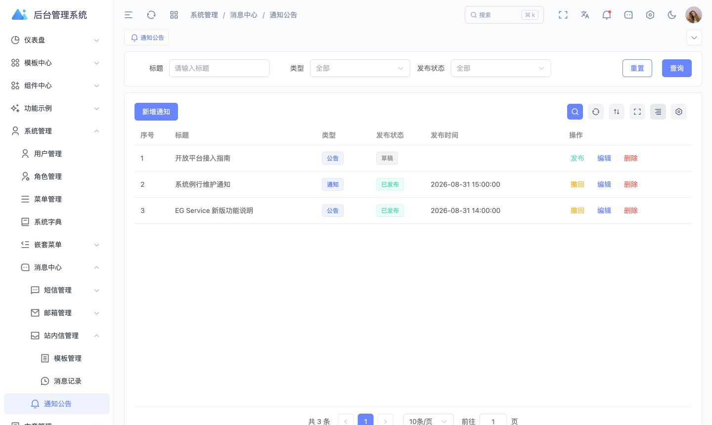
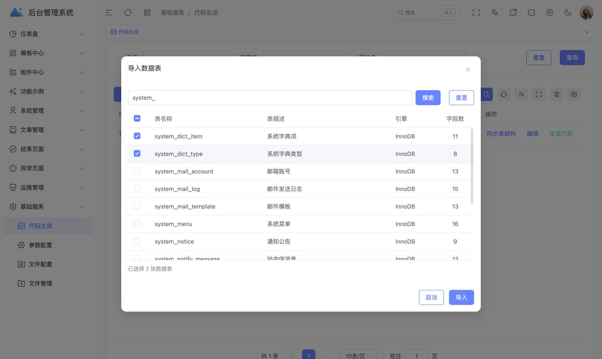
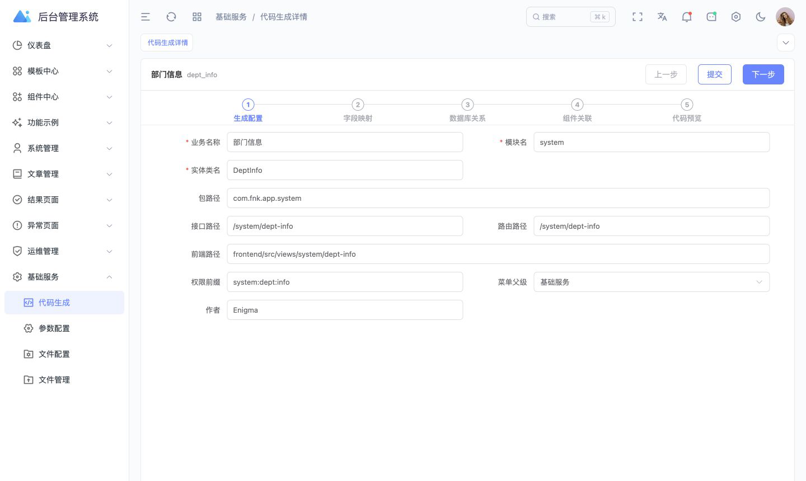
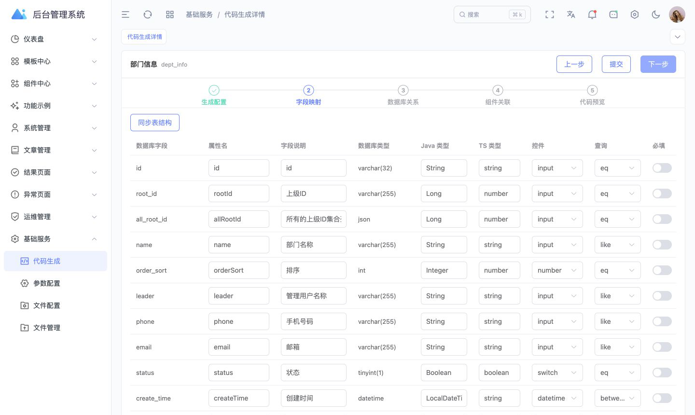

# EG Service

EG Service 是一个前后端一体的开源后台管理系统脚手架，提供用户、角色、菜单、权限、字典、消息中心、基础设施管理和代码生成等能力。

## 核心能力

- **权限与系统管理**：基于 Sa-Token、用户、角色、菜单和权限码实现后端动态菜单、页面访问与按钮级权限控制。
- **消息中心**：统一管理短信渠道、短信模板与发送日志，邮箱账号、邮件模板与发送记录，站内信模板、消息记录和通知公告。
- **代码生成**：从当前数据库检索未导入的数据表，支持搜索、多选导入，并在向导中配置生成参数、字段映射、数据库关系、组件关联和代码预览。
- **基础设施**：提供参数配置、文件存储配置、文件管理等后台基础能力，便于业务模块复用。
- **工程化前端**：基于 Art Design Pro 接入后端动态路由、统一请求响应、权限指令和业务管理页面。

## 技术架构

### 服务端

- Java 17、Spring Boot 3.2.0、Maven 多模块
- MyBatis-Plus、MySQL、Redis
- Sa-Token 权限认证
- Knife4j、springdoc OpenAPI
- Hutool

服务端采用应用入口、业务模块、基础设施和公共能力分层：

```text
app-server/app-server-admin       管理端应用启动入口
app-system/app-system-api         系统模块契约层
app-system/app-system-biz         系统模块业务实现
app-infra/app-infra-api           基础设施模块契约层
app-infra/app-infra-biz           基础设施模块业务实现
service-starter                   Web、安全、数据、文档等 Starter
service-common                    公共 Bean、数据库基础能力和工具
service-code-generate             独立代码生成器与模板
```

### 管理端

- 基于 Art Design Pro 二次开发
- Vue 3、TypeScript、Vite 7
- Element Plus、Tailwind CSS
- Pinia、Vue Router、Axios
- pnpm 10，Node.js 20.19 或更高版本

管理端通过后端菜单数据注册动态路由，通过 Sa-Token 登录态、角色菜单关系和权限码完成页面与按钮权限控制。

## 前端基座与致谢

管理端前端基于 [Art Design Pro](https://github.com/Daymychen/art-design-pro) 二次开发：

- 上游仓库：`Daymychen/art-design-pro`
- 官方文档：[artd.pro/docs](https://www.artd.pro/docs)
- 上游许可证：MIT License
- 上游版权声明：`Copyright (c) 2025 SuperManTT`

本项目在上游基座上完成了后端接口适配、Sa-Token 权限集成、后端动态菜单、系统管理、消息中心和代码生成页面等改造。上游许可证全文见 [`frontend/LICENSE`](frontend/LICENSE)，来源与同步说明见 [`frontend/UPSTREAM.md`](frontend/UPSTREAM.md)。

## 前端升级与版本分支

当前版本已将原有基于 Naive UI、UnoCSS 的管理端替换为 Art Design Pro、Element Plus 和 Tailwind CSS。本次升级属于前端基座迁移，不是兼容性的组件库依赖升级；旧版本的布局、路由、权限、请求封装和页面组件不能与当前版本直接混用。

- `main`：Art Design Pro、Element Plus 默认开发和主维护分支。
- `feat/naive-ui-maintenance`：保留 Naive UI、UnoCSS 旧版，用于兼容修复和存量项目维护，不再承接默认新功能。
- `naive-ui-baseline`：迁移前 Naive UI 完整代码的不可变基线标签。
- `feat/art-design-pro-element-plus`：新版本开发和迁移使用的历史集成分支，合并到 `main` 后不再长期维护。

| 对比项 | 当前主版本 | 旧版维护版本 |
| --- | --- | --- |
| 获取方式 | `main` | `feat/naive-ui-maintenance` |
| 前端基座 | Art Design Pro | 原 Naive UI 管理端 |
| UI 组件库 | Element Plus | Naive UI |
| 样式体系 | Tailwind CSS | UnoCSS |
| 维护策略 | 默认功能开发、缺陷修复和版本发布 | 存量项目兼容修复 |
| 固定基线 | 正式发布标签 | `naive-ui-baseline` |

两个前端版本拥有独立的依赖、锁文件、路由和组件体系。通用服务端修复可按兼容性选择性移植，前端页面与代码生成模板不应直接跨版本合并。

## 快速开始

### 1. 初始化数据库

创建 MySQL 数据库后导入 [`service.sql`](service.sql)。建议使用 `utf8mb4` 字符集。

### 2. 准备服务端配置

```bash
cp app-server/app-server-admin/src/main/resources/application-dev.example.yml \
  app-server/app-server-admin/src/main/resources/application-dev.yml
```

编辑本地 `application-dev.yml`，配置 MySQL、Redis 和 Sa-Token 密钥。真实配置已由 Git 忽略，请勿修改 Example 文件存放真实凭据。

### 3. 启动服务端

运行 `com.fnk.app.admin.AdminApplication`，或者执行：

```bash
./mvnw -pl app-server/app-server-admin -am spring-boot:run -Pdev
```

默认服务端端口为 `12345`。

### 4. 准备并启动管理端

```bash
cd frontend
cp .env.example .env
cp .env.development.example .env.development
pnpm install
pnpm dev
```

默认管理端地址为 `http://localhost:3006`。

## 编译与部署

后端编译：

```bash
./mvnw clean compile
./mvnw -pl app-server/app-server-admin -am package -DskipTests -Pprod
```

前端构建：

```bash
cd frontend
cp .env.example .env
cp .env.production.example .env.production
pnpm install --frozen-lockfile
pnpm build
```

Docker 镜像、Compose 和容器运行说明见 [`deploy/README.md`](deploy/README.md)。

## 界面预览

### 控制台


<table>
  <tr>
    <td width="50%">
      
      <br /><strong>用户与权限管理</strong>
    </td>
    <td width="50%">
      
      <br /><strong>邮件模板管理</strong>
    </td>
  </tr>
  <tr>
    <td width="50%">
      
      <br /><strong>站内信模板管理</strong>
    </td>
    <td width="50%">
      
      <br /><strong>通知公告管理</strong>
    </td>
  </tr>
  <tr>
    <td width="50%">
      
      <br /><strong>数据表搜索与多选导入</strong>
    </td>
    <td width="50%">
      
      <br /><strong>代码生成配置</strong>
    </td>
  </tr>
  <tr>
    <td colspan="2">
      
      <br /><strong>字段映射与生成规则</strong>
    </td>
  </tr>
</table>

## 配置与仓库约定

- 仓库只提交 `*.example` 示例配置，开发和生产真实配置均由 Git 忽略。
- `dev/`、`prod/`、`target/`、`frontend/dist/`、日志和上传文件不进入版本控制。
- 本地方案、临时分析和实施记录统一放入 `docs/private/`，该目录不进入版本控制。
- 服务端模块约定见 [`doc/server-module-spec.md`](doc/server-module-spec.md)。

## 许可证

本项目原创代码采用 [MIT License](LICENSE)。`frontend` 中来源于 Art Design Pro 的代码继续遵循其 MIT License 和原始版权声明，具体范围见 [NOTICE.md](NOTICE.md)。
